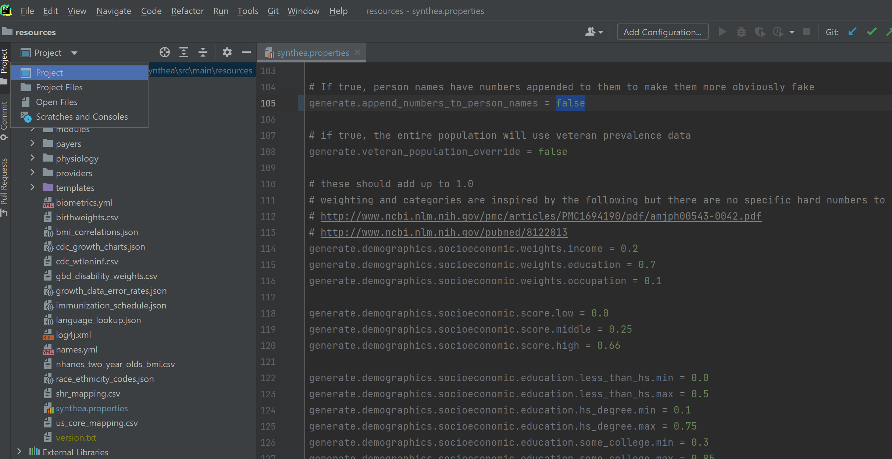

# Dataset Generation
* Synthetic data was created with the [Synthea](https://github.com/synthetichealth/synthea) module to model realistic healthcare data without legal or privacy concerns 
* Follow the directions found [here](https://github.com/synthetichealth/synthea/wiki/Developer-Setup-and-Running) for developer installation (Git and Java 1.8 JDK required)

### Configuration (optional)
* To remove numbers at the end of names when generated, navigate to the:
`directory\where\synthea\saved`
* Then continue to navigate: `\synthea\src\main\resources`
* Modify the `synthea.properties` file with an IDE; change the value of line 105 `generate.append_numbers_to_person_names` to `false` (see image)

* Save and exit

### Command Line
* Open up the CLI tool
* On Windows, navigate to the synthea folder; if you chose the default location, you can just use `cd synthea` to do so
* The `.\run_synthea` command allows for the following parameters (flags) to be added:
```
run_synthea [-h]
            [-s seed] 
            [-cs clinician seed]
            [-p populationSize]
            [-g gender]
            [-a minAge-maxAge]
            [-c localConfigFilePath]
            [-d localModulesDirPath]
            [state [city]]
```

### Generate the Data
* In our case, we will use the following parameters: Population - 100, Seed - 42, Location - Dallas, TX.
* Generate our 100 patient healthcare records
```
run_synthea -p 100 -s 42 Texas Dallas
```

### Data Output
* Our data was created in the following directory: `\synthea\output\fhir`
* The default data export setting is the FHIR JSON format but this can be changed if [needed](https://github.com/synthetichealth/synthea/wiki/Common-Configuration). 